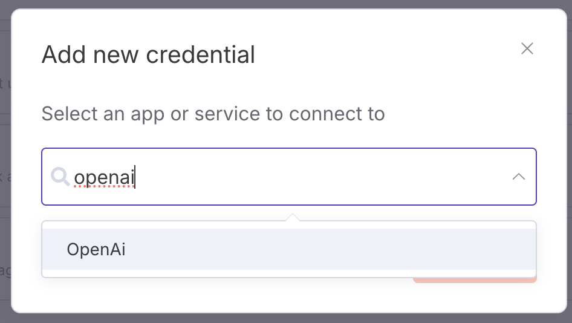
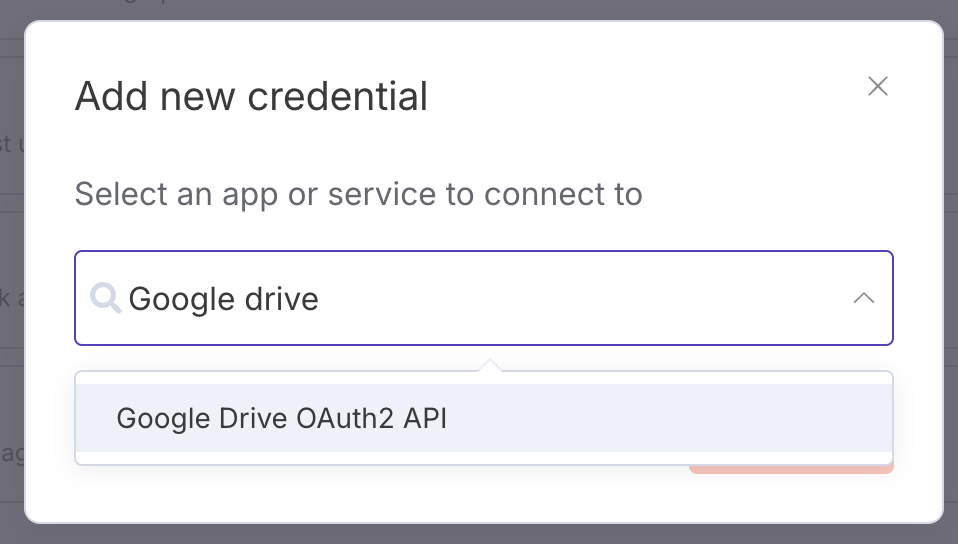
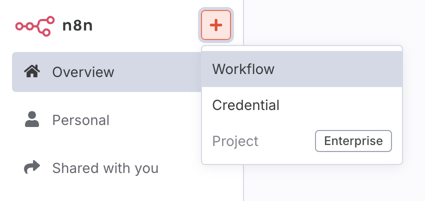
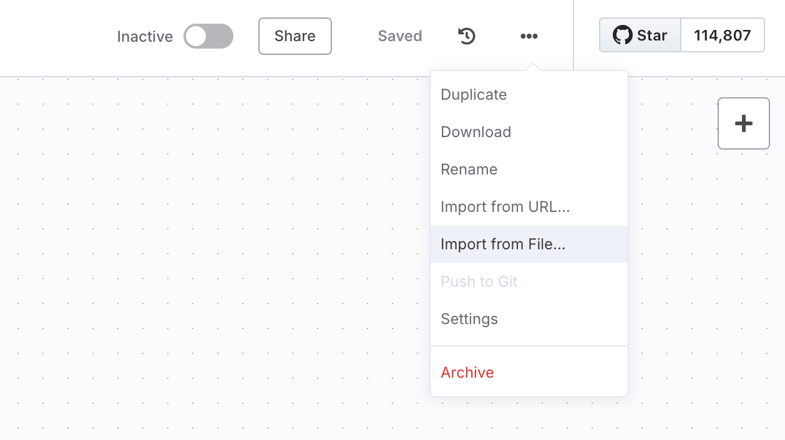
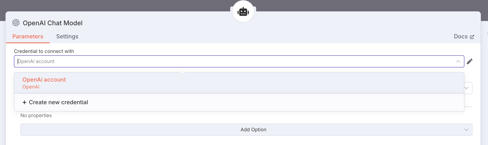
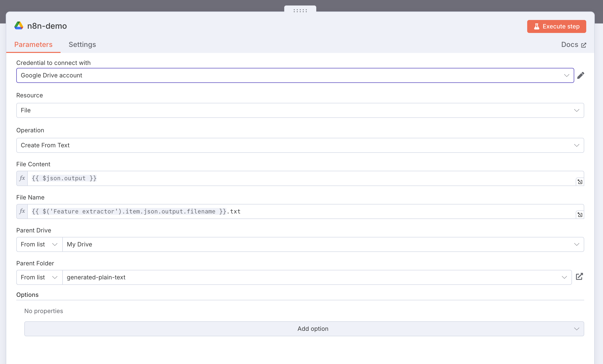
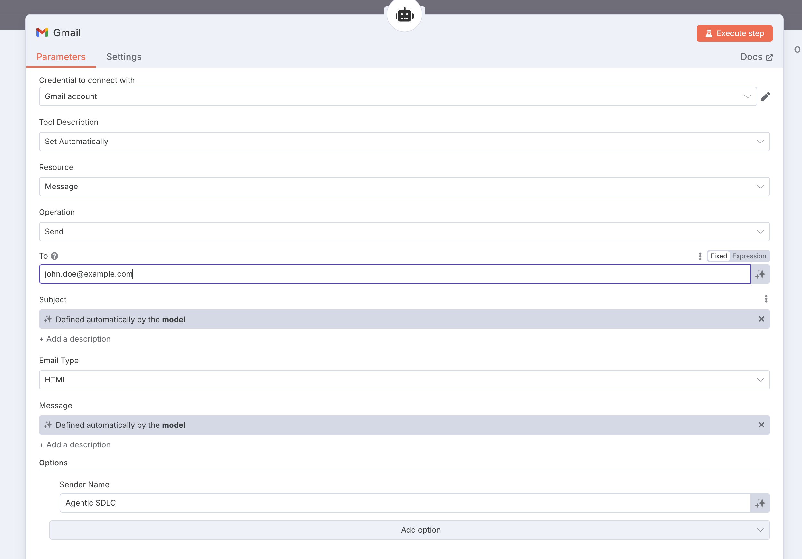

# Agentic SDLC POC

This project is a **Proof of Concept (POC)** that aims to supercharge the Software Development Life Cycle (SDLC) using agentic AI.

## Overview

The goal of this POC is to explore how agentic AI can automate, enhance, and streamline various stages of the SDLC, including requirements gathering, code generation, documentation, validation, and more.

This project uses **n8n** as the workflow automation platform to orchestrate and connect agentic AI tasks throughout the SDLC.

## Key Features
- **Agentic AI Integration:** Leverages AI agents to assist and automate SDLC tasks.
- **Workflow Automation with n8n:** Uses n8n to build and manage automated workflows for requirements, code, and documentation.
- **Extensible Prompts:** Modular prompt files for different SDLC activities.

## Project Structure
- `prompts/` — Prompt templates for various SDLC tasks
- `workflows/` — Example workflows demonstrating agentic SDLC automation
- `transciptions/` — Supporting files and documentation
- `*.yml` — Docker Compose and configuration files

## Getting Started
This is an experimental POC. Please refer to the workflow and prompt files for examples of agentic SDLC automation. To run or modify workflows, use the n8n platform as described in the workflow files.

## Running the Project

To boot up n8n, Postgres, and pgvector services, simply execute the provided `start.sh` script from your project root directory:

```sh
./start.sh
```

This script will use the `n8n-docker-compose.yml` file to start all required services in the background. Once started, you can access the n8n web interface at [http://localhost:5678](http://localhost:5678).

Make sure you have Docker and Docker Compose installed on your system before running the script.


### Create credentials

To use OpenAI and Google services in n8n workflows, you need to create the corresponding credentials:


#### OpenAI Credentials
1. In your n8n instance, click the **Credentials** icon (key symbol) on the left sidebar.
2. Click **Create New** and search for **OpenAI**.
3. Select **OpenAI API**.


4. Enter your OpenAI API Key (you can obtain this from your OpenAI account dashboard).
5. Save the credential.


#### Google Drive OAuth2 API Credentials
1. In your n8n instance, click the **Credentials** icon (key symbol) on the left sidebar.
2. Click **Create New** and search for **Google Drive OAuth2 API**.
3. Select **Google Drive OAuth2 API**.

4. Enter your Google Client ID and Client Secret (obtain these from the Google Cloud Console by creating OAuth 2.0 credentials for your project).
5. Click **Connect OAuth** and follow the prompts to authenticate with your Google account.
6. Save the credential.

Once created, you can select these credentials in your workflow nodes that require access to OpenAI or Google services.


### Importing Workflows into n8n

To import the example workflow `.json` files from the `./workflows` directory into n8n:

1. Open your n8n instance in your browser.
2. Click the **plus (+)** button on the top left sidebar to create a new workflow.
3. Click **Workflow** to open a new workflow canvas.
4. Click the three dots (**...**) on the top right sidebar.
5. Select **Import from File**.
6. Choose the desired `.json` file from the `workflows/` directory in this project.
7. Review and activate the workflow as needed.
8. For any nodes that require credentials (e.g., OpenAI or Google Drive), select the credentials you have just created from the credentials dropdown in the node's settings panel.






### Setup OpenAI credentials
 For any OpenAI node, select the credential you have just created from the credentials dropdown in the node's settings panel.




### Setup your own Google Drive folders

To use Google Drive nodes in your workflows, configure each Drive node to point to a specific folder in your Google Drive account:

1. In your imported workflow, click on a **Google Drive** node.
2. In the node settings panel, select the Google Drive credential you created earlier.
3. For the **Folder** field, click the folder picker or enter the folder ID/path where you want the node to operate (e.g., upload, read, or write files).
4. Save the node settings.
5. Repeat for any other Google Drive nodes as needed.

This ensures your workflow interacts with the correct folder in your Google Drive account.



### Setup a GMail account

To use Gmail nodes (e.g., for sending emails) in your workflows, configure each Gmail node as follows:

1. In your imported workflow, click on a **Gmail** node (such as the agent tool node).
2. In the node settings panel, select the Gmail credential you created earlier from the credentials dropdown.
3. In the **To** (or destination email) field, enter the email address where you want to send messages.
4. Fill in any other required fields (subject, message, etc.) as needed.
5. Save the node settings.
6. Repeat for any other Gmail nodes as needed.

This ensures your workflow sends emails using your Gmail account and to the correct destination address.



## Troubleshooting

### Accessing MCP from n8n (Docker)

If you are running n8n using Docker, you cannot use `localhost` to connect to services (such as the MCP server) running on your host machine. Instead, you must use the appropriate hostname that is accessible from within the Docker network.

**Solution:**
- Update your MCP client configuration in n8n to use the hostname or IP address of your host machine, not `localhost` or `127.0.0.1`.
- For example, if your host machine's IP address is `192.168.1.100`, use `http://192.168.1.100:PORT` as the MCP endpoint.
- Alternatively, if MCP is running as another Docker service in the same Docker Compose network, use the service name as the hostname (e.g., `http://mcp:PORT`).

This ensures that n8n can successfully communicate with the MCP service.


## Disclaimer
This project is for demonstration and experimentation purposes only.
